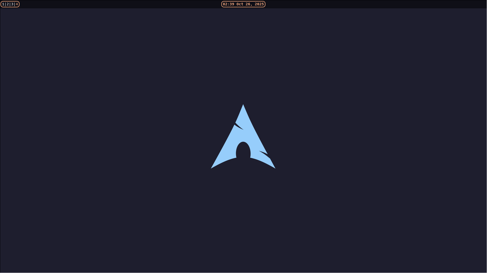

# Introduction
This is a collection of dotfiles I have created for my Wayland enviornment. It's highly **incomplete** and meant for a personal backup, if you happened to find this repo, perhaps you can use it as a starting point or examples :)  I really enjoy using catppuccin theme a lot, so I decided to have a similar color palette. The one I'm using is **Macchiato Peach**, it gives me a feeling of warmth.

# Environment
WM: [Hyprland](https://hypr.land)  
bar: [ewww](https://github.com/elkowar/eww)  
application launcher: [rofi](https://github.com/davatorium/rofi)  
lock: [hyprlock](https://github.com/hyprwm/hyprlock)  
wallpaper: [swww](https://github.com/LGFae/swww)  
